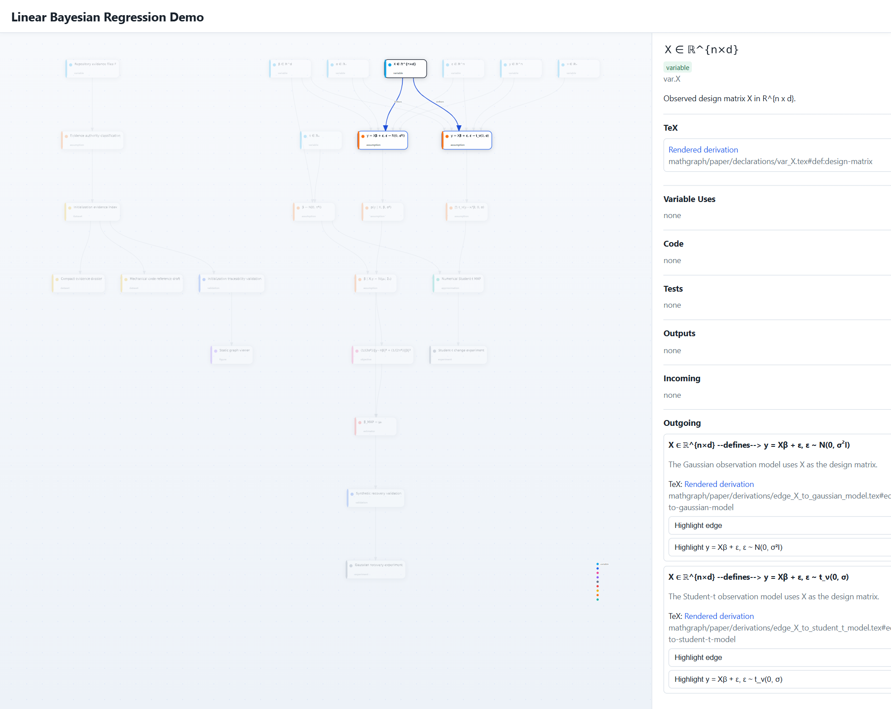

# Mathgraph

When engineering or researching an idea by vibe coding with an agent, it is easy for the agent to drift away from the idea actually being explored. Code, docs, and models start changing locally, but the underlying intent becomes blurry. That is the problem `mathgraph` targets.

`mathgraph` is a skill and workflow that makes the agent root updates in a latent representation of the idea so code, docs, models, tests, and outputs stay consistent with what the project is really about.

Because mathematics can express precise ideas with very few symbols, `mathgraph` parameterizes that latent representation as a graph of mathematical objects. The result is that the agent can keep precise ideas in context, make code changes that respect the idea of interest, and give the engineer or scientist an interface for maintaining ownership of the project without reading a single line of agent-written code.

## Install

```bash
git clone https://github.com/davstrom99/mathgraph.git
cd mathgraph
pip install -e ".[dev]"
```

## Quick Start

It is easy to get started in an existing project:

1. Install the Codex skill by copying `codex-skill/mathgraph-centered-research/` into `~/.codex/skills/`.
2. In your project root, prompt codex with /mathgraph init.
3. Render the graph with `mathgraph render`.

A good first Codex prompt to try is:

```text
/mathgraph Explain the main model branches, missing validations, and the highest-impact next improvement.
```

## Example

This repository includes a self-contained demo under `examples/linear_bayes_demo/` with a Gaussian branch and a Student-t alternative branch.

Rendered graph view:



Inspect the graph and render the viewer:

```bash
mathgraph node estimator.beta_map
mathgraph impact model.gaussian_observation --verbose
mathgraph render
python -m http.server 8000 --bind 127.0.0.1 -d web
```

Run the example experiments:

```bash
python examples/linear_bayes_demo/experiments/run_gaussian_recovery.py
python examples/linear_bayes_demo/experiments/run_student_t_change.py
```

## Commands

- `mathgraph init`: bootstrap mathgraph files for an existing repository.
- `mathgraph index build`: build the initialization evidence index used during onboarding and checking.
- `mathgraph index dossier`: show a compact cross-file evidence summary for the indexed project.
- `mathgraph check`: validate the graph, references, and traceability invariants.
- `mathgraph node <node-id>`: inspect one graph node with its TeX, code, tests, outputs, and edges.
- `mathgraph impact <node-id>`: show what downstream nodes, code, tests, experiments, and outputs depend on a node.
- `mathgraph coverage`: summarize implementation, validation, and TeX coverage across the graph.
- `mathgraph orphans`: find Python symbols that are not attached to any graph node.
- `mathgraph render`: generate the static interactive graph viewer in `web/`.
- `mathgraph draft-refs <symbol-or-node-id>`: emit draft exact-line code references for graph construction.
- `pytest`: run the automated test suite.
